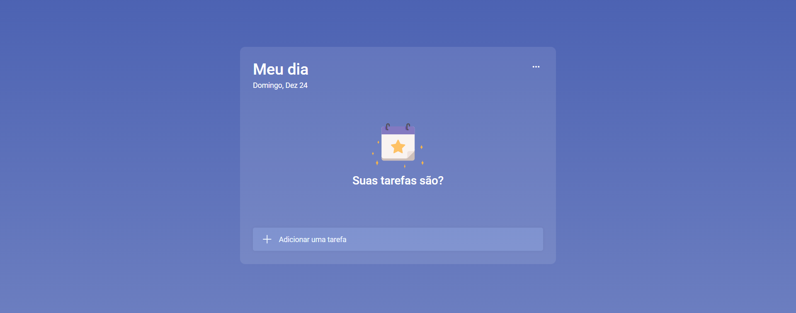

<div align="center">

<b>Aplicativo Taskbuddy - Amigo de tarefa (em testes)</b>

  <p>Taskbuddy é um aplicativo de tarefas totalmente responsivo para todos os dispositivos, construído usando HTML, CSS e JavaScript.</p>

  <a href="https://apptaskbuddy.netlify.app/"><strong>Demonstração ao vivo</strong></a>
</div><br>


<b>Capturas de tela de demonstração:</b>



<b>Pré-requisitos:</b>

<p>Antes de começar, certifique-se de atender aos seguintes requisitos:</p>

[Git](https://git-scm.com/downloads "Download Git") deve ser instalado em seu sistema operacional.

<b>Execute localmente:</b>

<p>Para executar o <b>Taskbuddy</b> localmente, execute este comando em seu git bash:</p>

<b>Linux e macOS:</b>

```bash
git clone https://github.com/daniel-portela/taskbuddy.git
```

<b>Windows:</b>

```bash
git clone https://github.com/daniel-portela/taskbuddy.git
```

Depois de clonar o repositório, acesse o projeto com o seguinte comando:

```bash
cd nome-do-repositorio
```

<b>Contato:</b>

<p>Se você quiser entrar em contato comigo, sinta-se a vontade.</p> 

<a href="https://linkedin.com/in/danielengineer" target="_blank">
  
</a>
 <a href="https://instagram.com/danielfront_" target="_blank">
 
</a>
 <a href="https://wa.me/77999109489" target="_blank">
 
</a>

<br><b>Licença</b>

<p>Este projeto é de uso gratuito e não contém nenhuma licença.</p>

